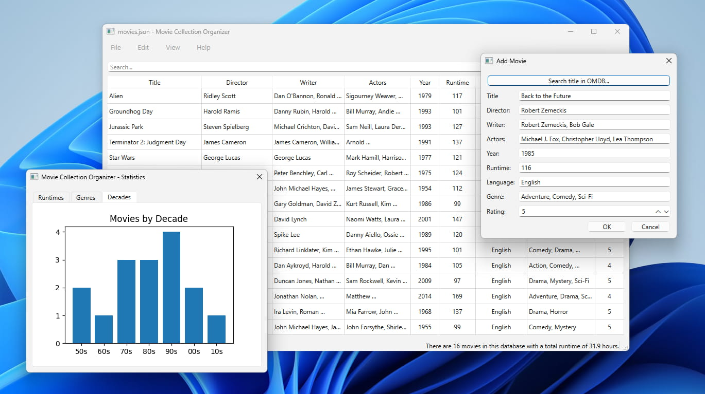

# Movie Collection Organizer

**Movie Collection Organizer** is a simple tool for building and managing a personal movie database. Built with Python and Qt (PySide6), it stores data in plain JSON files, supports automated requests to the [OMDb API](https://www.omdbapi.com/), and features basic data analysis to help you visualize your collection.



## Features

While the application allows you to enter movie details manually, it was primarily designed to automatically fetch data from the OMDb API. After obtaining a free [API key](https://www.omdbapi.com/), simply navigate to **File > Settings** and enter your key. The option to fetch data from OMDb will automatically appear in the **Add Movie** window.

The application also provides descriptive data analysis based on your collection. Attributes like runtimes, decades, and genres are displayed as visual plots to give you a statistical summary of your library.

The built-in search functionality supports both keyword matching and exclusion. You can easily exclude specific strings from your search results by adding a `-` prefix to the word.

As a *passion project* driven by my own love for moveis, I plan to add several new features in the near future, including:

- Allowing users to freely sort the database by any column or attribute.
- Adding more advanced plots and statistics to provide even deeper insights into your viewing habits.
- Implementing a sophisticated search syntax to filter movies by specific attributes and thresholds (e.g. `rating > 3 & year > 2000`).
- Fetching movie posters and implementing an image-focused *Poster View* in addition to the default table view.

## Usage

Because this project is currently focused on active development rather than widespread distribution, pre-compiled binaries are not yet provided.

To run the application, you will need Python 3 and a few external packages (`numpy`, `matplotlib`, `PySide6` and `requests`). You can install all dependencies at once using the provided `requirements.txt` file:

```
pip install -r requirements.txt
```

Once the dependencies are installed, launch the application by running `run.py`:
```
python run.py
```